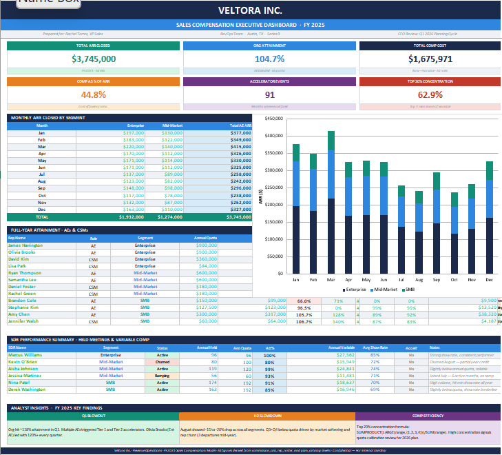
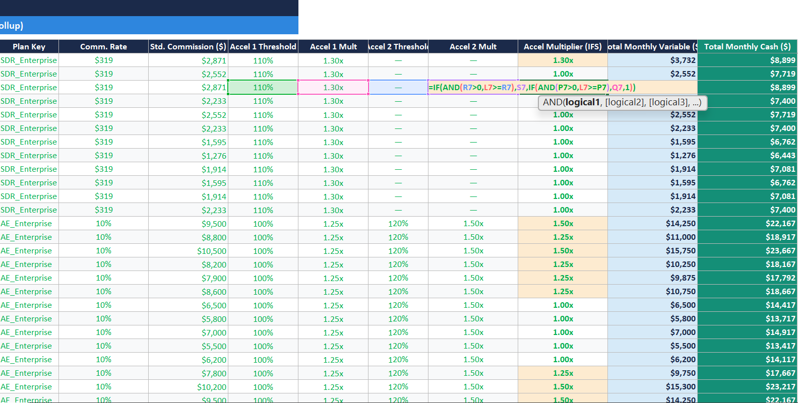
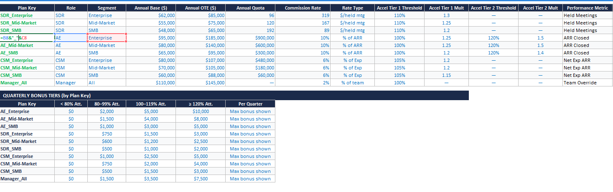
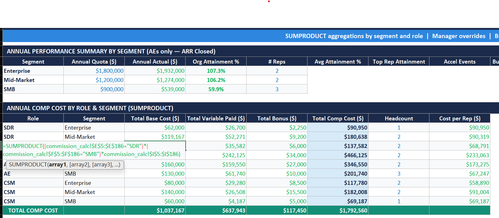

README.md 

# Veltora Inc. — Sales Compensation Model · FY 2025

**Tools:** Microsoft Excel  
**Skills:** VLOOKUP · SUMPRODUCT · Nested IF · Array formulas · Data validation · Conditional formatting  
**Data:** Fictional company and dataset based on research conducted on past Series B 
SaaS companies — rep churn rates, ramp schedules, seasonal patterns, and Accelerators reflect real benchmarks from that stage

## The Business Problem

Veltora closed a Series B in January 2025 with $31M ARR and a target  to hit $46M by year-end — 48% growth. Before locking the 2026 comp budget, the CFO had three questions: Is the current structure motivating the right behaviors? How much did accelerators cost versus the revenue they generated? And where is comp spend concentrated — is it tracking performance or exposing a quota-setting problem?

This model was built to answer all three.

## What I Built

A nine-sheet Excel workbook organized in three layers: inputs, calculations, and outputs. 
Change any assumption, and it flows through every calculation automatically. Update a comp rate in one cell, and the entire model updates.
**Inputs**
- `assumptions` — company context, ARR targets, headcount plan
- `plan_catalog` — every comp rate, quota, and accelerator threshold  in one place. The single source of truth for the entire model.
- `rep_roster` — 21 reps with role, segment, city, start/end dates, 
  and status

**Calculation Engine**
- `monthly_actuals` — what each rep actually did each month
- `sdr_meeting_tracker` — booked vs. held meetings, show rate flags
- `commission_calc` — the main engine. Every rep, every month, exact payout including accelerators
- `quarterly_bonus` — monthly data rolled up to quarters, bonus tiers applied

**Outputs**
- `team_rollup` — segment-level comp cost, manager overrides,  budget vs. actual
- `dashboard` — executive view. KPI cards, charts, attainment by rep, SDR summary, analyst insights

## The Sales Team

18 ICs and 3 managers across three segments: Enterprise, Mid-Market, 
and SMB. Reps are spread across Austin, NYC, San Francisco, Chicago, 
Denver, Dallas, and Houston — reflecting a hybrid Series B team that 
isn't limited to HQ locals.

The roster was designed to reflect real mid-year dynamics. Three reps 
churned across Q2 and Q3, each replaced on a staggered schedule with a 
three-month ramp at 40%, 70%, and 100% of quota. One rep is a standout 
overperformer, one is on a PIP, and August shows the seasonal dip you'd 
expect from a company selling to enterprise buyers.

None of this was random. Every pattern was based on research into what a typical Series B SaaS sales team actually looks like in year one of 
aggressive growth.

## The Compensation Structure

Each role and segment has its own comp plan, as Enterprise reps carry higher bases and larger quotas than their Mid-Market and SMB counterparts.

| Role | Segment | Base | OTE | Quota | Commission | Accelerators |
|---|---|---|---|---|---|---|
| SDR | Enterprise | $62K | $85K | 96 held mtgs | $319/mtg | 1.30x > 110% |
| SDR | Mid-Market | $55K | $75K | 120 held mtgs | $167/mtg | 1.25x > 110% |
| SDR | SMB | $48K | $65K | 192 held mtgs | $89/mtg | 1.20x > 110% |
| AE | Enterprise | $95K | $185K | $900K ARR | 10% | 1.25x >100%, 1.50x >120% |
| AE | Mid-Market | $80K | $140K | $600K ARR | 10% | 1.25x >100%, 1.50x >120% |
| AE | SMB | $65K | $95K | $300K ARR | 10% | 1.20x >100%, 1.40x >120% |
| CSM | Enterprise | $80K | $107K | $480K net exp | 6% | 1.20x > 105% |
| CSM | Mid-Market | $70K | $105K | $180K net exp | 6% | 1.20x > 105% |
| CSM | SMB | $60K | $88K | $60K net exp | 6% | 1.15x > 105% |
| Manager | All | $110K | $145K | — | 2% override | Bonus at 100% team att |

SDRs are measured on qualified held meetings rather than pipeline 
generated. A meeting only counts if the rep meets the minimum show rate threshold for their segment: 75% for Enterprise, 70% for 
Mid-Market, and 65% for SMB.

## Key Excel Techniques

### VLOOKUP with dynamic lookup keys
Instead of hardcoding rates for each rep, every row in the commission engine builds its own lookup key from the rep's role and segment, then pulls the right rate from the plan catalog. 
Change one number and the whole model updates. That's the point.

### SUMPRODUCT as a conditional aggregator
Most people reach for a pivot table here. I used SUMPRODUCT instead because it's live — no refreshing, no manual steps. It applies multiple conditions across 182 rows of rep-month data and returns exactly what you need. The dashboard, team rollup, and quarterly bonus sheets all run on it.

### Nested IF for tiered accelerator logic
Accelerators are what make comp plans interesting and expensive. 
The nested IF checks attainment against two thresholds and applies the right multiplier; same logic a real comp system would use. 
You can see this fire in the Q1 data.

### Array formula for comp concentration
SUMPRODUCT combined with LARGE and an inline array constant. 
It answers one question: are the top 20% of earners taking a disproportionate share of variable comp? If the answer is yes, 
quota distribution probably needs a look before the next plan year.

## Key Findings

**Q1 accelerators were expensive and earned.**
The org hit roughly 118% attainment in Q1. Multiple reps triggered Tier 1 and Tier 2 accelerators, which cost more in comp but produced 
proportionally more revenue. The model makes that tradeoff visible for the first time.

**H2 softening is a pattern, not a surprise.**
August shows a 15 to 20% drop across all three segments. That is not random; it is a planning signal. Veltora should either build 
seasonality into 2026 quotas or front-load pipeline targets in Q2 to buffer the slowdown before it hits.

**Rep churn costs more than the salary savings.**
Three reps left mid-year. The model captures not just the payroll savings but the quota gap: the months where the territory went 
uncovered and revenue was left on the table. That is the real cost of attrition.

**Comp concentration is worth watching.**
The top 20% of earners took a sizeable share of variable compensation. That can mean two things: either those reps are genuinely 
exceptional, or some quotas are set too low. This is worth investigating before locking in the 2026 plan design.

## Screenshots

### Dashboard

### Commission Calculation Engine

### Plan Catalog

### Team Rollup

## How to Use This File

Download `Veltora_SalesComp_FY2025.xlsx` and open it in Microsoft Excel. 
Google Sheets is not recommended as some formulas may not render correctly.

Start with `assumptions` for context, `plan_catalog` to see the 
comp structure, and `dashboard` for the executive summary. From 
there, `commission_calc` has every rep, every month, and every 
formula fully visible and traceable.
